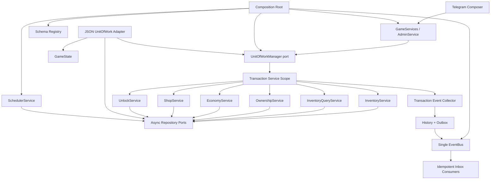

# Мир Сливки: Architecture Stabilization v1.0

Статус: implemented.

Версия: 1.0.0.

## Цель

Этап стабилизирует инфраструктурные границы без добавления игровых механик и без изменения Telegram-команд. Application и Domain больше не знают о `GameState`; JSON остаётся текущим adapter, а публичные facades сохраняют совместимость.

## Module Dependency Diagram

Разрешённое направление зависимостей: Telegram -> Application -> Domain/Ports. Infrastructure реализует ports и подключается только Composition Root. Domain не импортирует Application или Infrastructure.

## Реализация этапов

1. `createCompositionRoot()` создаёт Catalog, один EventBus, UnitOfWork, service scope factory, facades, Scheduler, Outbox dispatcher, retention и schemas.
2. Все repository ports возвращают `Promise`; JSON adapters возвращают detached copies и требуют явного `save`, поэтому семантика чтения совпадает с будущим PostgreSQL.
3. `GameState` находится в `infrastructure/storage/game-state.ts` и используется только JSON adapters.
4. `JsonUnitOfWorkManager` создаёт transaction-bound repositories и выполняет одну атомарную запись state.
5. `TransactionEventCollector` валидирует и накапливает события; History/Outbox записываются до commit, EventBus вызывается после commit.
6. EventBus создаётся только Composition Root и передаётся всем publishers/dispatchers.
7. Domain event содержит `eventId`, `eventType`, `eventVersion`, `aggregateId`, `aggregateVersion`, `occurredAt`, `correlationId`, `causationId`, `payload` и дополнительный `aggregateType`.
8. Schema Registry валидирует attributes, metadata, event payloads, scheduler payloads и Telegram callback payloads; лимиты составляют 256 KiB, 32 уровня и 10 000 nodes.
9. Scheduler хранит task, payload schema/version, idempotency key, attempts и lease в JSON. После рестарта просроченный `running` lease возвращается в обработку. Игровой `setTimeout` не используется.
10. Retention ограничивает History, Outbox, Inbox, idempotency, terminal Scheduler tasks, Inventory operations и UI sessions.
11. Architecture tests проверяют границы импортов, async repository contracts, единственное место создания EventBus/services, циклические зависимости и запрет обхода Inventory/Ownership/Shop services из orchestrators.
12. `GameServices`, `AdminService`, `createRpgComposer`, команды и callback data сохранены; `createRpgRuntime` добавляет корректный shutdown Scheduler.

## Runtime Storage

`runtime.version = 1.0.0` содержит:

- `history`: центральный журнал versioned domain events;
- `outbox`: pending/failed/published/dead-letter delivery records;
- `inbox`: consumer idempotency с processing lease;
- `idempotency`: bounded operation results для общих integration workflows;
- `schedulerTasks`: durable timer tasks с lock, retry и terminal state.

Legacy `inventory.history/outbox` и `ownership.history/outbox` идемпотентно переносятся в runtime storage. Player/family inventory arrays остаются compatibility projections; source of truth сохраняют Inventory и Ownership.

## Retention Policy

| Данные | Срок | Удаляемые состояния |
|---|---:|---|
| History | 180 дней | события старше cutoff |
| Outbox | 7 дней | `published`, `dead_letter` |
| Inbox | 30 дней | `processed`, stale `failed`/expired `processing` |
| Runtime idempotency | 7 дней | expired |
| Scheduler tasks | 30 дней | `completed`, `cancelled`, `failed` |
| Inventory operations | 30 дней | завершённые operation records |
| Inventory action sessions | 2 дня | terminal |
| Shop checkout sessions | 2 дня | terminal |

Outbox выполняет до 20 попыток с exponential backoff до одного часа. Inbox processing lease равен пяти минутам. Failed scheduler task хранится для диагностики 30 дней.

## Изменённые контракты и сервисы

- Async ports: Catalog, Player, Family, MarriageProposal, Economy, AuditLog, Stats, Unlock, Inventory, Ownership, Shop, Event, Scheduler, Retention, legacy projections и owner directory.
- Расширены: GameServices, AdminService, PlayerService, EconomyService, InventoryService, OwnershipService, ShopService, UnlockService, CatalogService и RequirementEvaluator.
- Добавлены: InventoryQueryService, SchemaRegistry, TransactionEventCollector, SchedulerService, TransactionSchedulerService, RetentionService, OutboxDispatcher, UnitOfWorkManager и transaction service scope factory.
- Infrastructure: JSON UnitOfWork, state-bound repository adapters, SystemClock и атомарный JsonGameDatabase.

## Финальный архитектурный аудит

- System Architecture и Clean Architecture: Telegram зависит только от application facades; Domain/Application не импортируют Infrastructure или GameState.
- Composition: EventBus и application services создаются только в `bootstrap/composition-root.ts`; production runtime получает один EventBus.
- Repository/UoW: все ports асинхронны; JSON repositories не возвращают изменяемые ссылки на state; commit выполняется одной UnitOfWork.
- Service boundaries: GameServices и Scheduler больше не изменяют Inventory, Ownership или Shop repositories напрямую. Все transitions action session, reservation, lease, permission и checkout выполняют соответствующие services.
- CQRS: Inventory read-модель выделена в `InventoryQueryService`; прежние query methods InventoryService сохранены как compatibility delegation. Полный Event Sourcing не применяется согласно утверждённому варианту B.
- Event-driven: события версионированы, валидируются Schema Registry, сохраняются в History/Outbox до commit и публикуются после commit; Inbox обеспечивает идемпотентность consumers.
- Performance: History и Shop orders получают owner/actor filter и pagination на repository boundary; per-player purchase limit использует отдельный aggregate query.
- DRY/SOLID: Outbox retry/dead-letter policy едина для post-commit publisher и background dispatcher; query responsibilities отделены от Inventory commands.
- Проверка: 28 functional, transactional, migration, repository-semantics и architecture tests проходят.

## Файловый реестр

Изменены существующие entry points и compatibility facades:

- `package.json`, `src/rpg-bot.ts`, `src/rpg/index.ts`;
- `src/rpg/bot/rpg-composer.ts`;
- `src/rpg/application/admin-service.ts`, `game-services.ts`, `economy-service.ts`, `player-service.ts`;
- `src/rpg/domain/types.ts`;
- `src/rpg/infrastructure/storage/json-game-database.ts`;
- `docs/rpg-architecture.md`, `docs/inventory-v1.0.md`, `docs/shop-v1.0.md`.

Добавлены или сформированы для стабилизации:

- `src/rpg/bootstrap/composition-root.ts`, `schema-registrations.ts`;
- `src/rpg/application/admin-service-v2.ts`, `game-services-v2.ts`, `catalog-service.ts`, `event-bus.ts`, `inventory-service.ts`, `ownership-service.ts`, `shop-service.ts`, `unlock-service.ts`, `requirement-evaluator.ts`;
- `src/rpg/application/schema-registry.ts`, `transaction-event-collector.ts`, `transaction-services.ts`, `transaction-scheduler-service.ts`, `scheduler-service.ts`, `outbox-dispatcher.ts`, `retention-service.ts`;
- все contracts в `src/rpg/application/ports/`;
- `src/rpg/domain/events.ts`, `runtime.ts`, а также сохранённые модели assets/inventory/ownership/shop/unlocks;
- все JSON adapters в `src/rpg/infrastructure/repositories/`, `storage/game-state.ts`, `system-clock.ts`, `unit-of-work/json-unit-of-work-manager.ts`;
- `src/rpg/tests/architecture.test.ts`, `stabilization-v1.test.ts` и адаптированные Shop/Inventory integration tests;
- `docs/architecture-stabilization-v1.0.md`.

Удалённых файлов, сервисов, команд, меню или игровых категорий нет. `dist/` содержит сгенерированный результат успешной TypeScript-компиляции.

## Проверка

- `npm run build` - strict TypeScript без emit.
- `npm run test:rpg` - функциональные, транзакционные, migration и architecture tests.
- `npm run test:architecture` - независимая проверка архитектурных границ и циклов.
- Conflict markers проверяются перед завершением этапа.

## Остаточные риски

- JSON adapter сериализует весь state и рассчитан на один процесс; он не является хранилищем для 100 000 игроков.
- In-process EventBus не доставляет события при остановленном процессе; durable Outbox возобновляет их после запуска Scheduler.
- Delivery имеет семантику at-least-once; каждый consumer обязан использовать Inbox или собственный idempotency key.
- Текущие JSON repository indexes находятся в памяти и не заменяют database indexes.
- Runtime History retention удаляет горячие данные; PostgreSQL-версия должна предусмотреть архив или партиции согласно требованиям аналитики.
- Legacy GameServices остаётся совместимым anti-corruption facade для старых Profile/Family/Jobs/Travel workflows. Его дальнейшее разбиение допустимо только отдельным утверждённым этапом без изменения команд.
- Рейтинги пока рассчитываются чтением текущего JSON state. Для PostgreSQL и 100 000+ игроков нужны отдельные event-driven read projections, иначе появятся full scan и N+1 запросы.
- DDD применяется на уровне bounded responsibilities, domain contracts, invariants и service authorities. Переход к rich aggregates нужен выборочно для высококонкурентных сущностей после появления PostgreSQL, а не как массовая переработка текущей архитектуры.

## Переход на PostgreSQL

1. Реализовать PostgreSQL repositories для каждого существующего async port без изменения Application API.
2. Заменить JSON UnitOfWork на transaction manager, передающий одну connection/transaction всем repositories scope.
3. Создать таблицы events, outbox, inbox, idempotency и scheduler tasks с unique constraints на event ID и idempotency keys.
4. Claims Outbox и Scheduler выполнять через `FOR UPDATE SKIP LOCKED`; использовать lease owner и lock expiration.
5. Разделить InventoryEntry, OwnershipRecord, permissions, orders, ledger и projections на нормализованные таблицы; metadata/state хранить в validated JSONB.
6. Добавить optimistic aggregate version checks и database constraints для quantity, balances и единственного active ownership.
7. Перенести JSON snapshot идемпотентным importer с reconciliation report, checksum, dry-run и повторной сверкой counts/sums.
8. Партиционировать History/Outbox по времени после подтверждения профиля нагрузки; добавить keyset pagination и read projections.
9. Выполнить dual-read verification на копии production state, затем остановить запись, импортировать delta и переключить Composition Root на PostgreSQL adapters.

PostgreSQL-этап не требует изменения Telegram-команд, domain events или application service signatures.

## Готовность к Transport v1

Архитектурные границы позволяют проектировать Transport v1 поверх Catalog, InventoryQueryService, InventoryService, OwnershipService, EconomyService, Scheduler и EventBus без прямого доступа к storage. Начинать реализацию следует только после отдельного утверждённого документа Transport v1. PostgreSQL adapter не блокирует доменное проектирование Transport, но обязателен до целевой эксплуатации на 100 000+ игроков.
