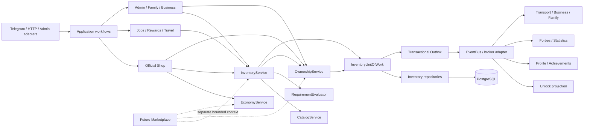
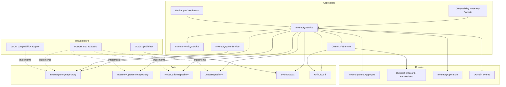
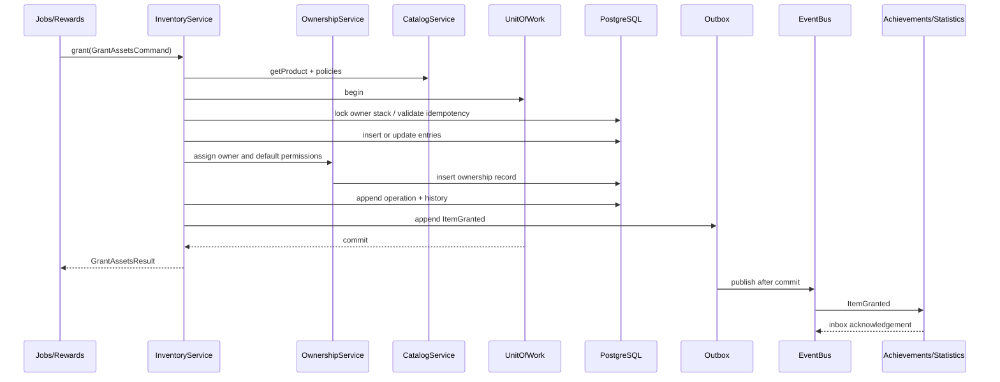
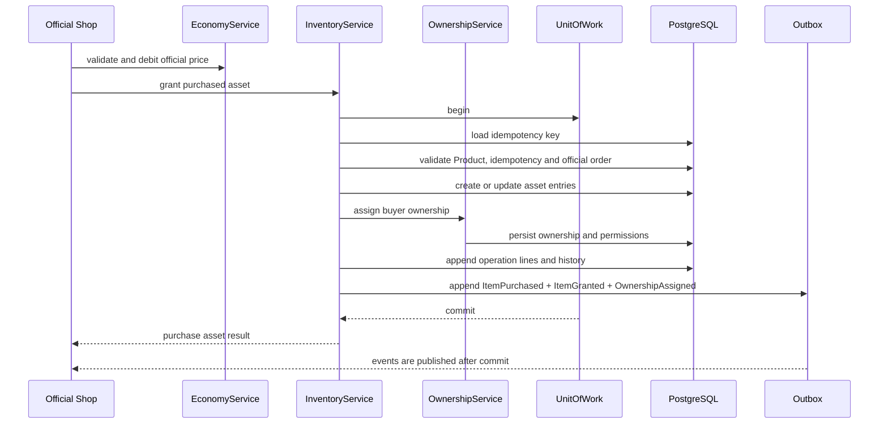

# Мир Сливки: Inventory v1.0

Статус: утверждено для реализации с финальными поправками Ownership/Economy/Shop.

Версия документа: 1.0.0.

## 1. Цель системы

Inventory v1.0 является единым источником истины о существовании, количестве, состоянии, местоположении и жизненном цикле игровых активов. `OwnershipService` является отдельным источником истины о юридическом владельце, custody и правах доступа. Ни один прикладной модуль не хранит собственный список принадлежащего игроку транспорта, недвижимости, бизнесов, лицензий или иных активов.

Inventory решает следующие задачи:

- единообразно хранит штучные объекты, stacks, права и услуги, но не денежные средства;
- получает юридического владельца, custody и permissions только через `OwnershipService`;
- атомарно выдаёт, изымает, передаёт, резервирует и изменяет активы;
- защищает операции версиями, блокировками и ключами идемпотентности;
- хранит полную неизменяемую историю каждого объекта и stack;
- публикует доменные события для Profile, Achievements, Forbes, Family и других проекций;
- предоставляет универсальные операции официальному Shop, Jobs, Admin, Rewards, Travel и будущим системам;
- позволяет заменить JSON-репозиторий PostgreSQL-репозиторием без изменения Telegram-команд и application-контрактов.

Транспорт, бизнес и недвижимость нельзя хранить отдельно, потому что это создаёт несколько источников истины, разные правила передачи и дублирование истории. Специализированные модули хранят только собственные данные поведения: Transport — пробег и правила эксплуатации, Business — производство и доходность, RealEstate — параметры использования. Inventory хранит объект и его состояние, а Ownership хранит владельца и права. Денежные средства, счета, balances и ledger полностью принадлежат EconomyService.

Shop и Marketplace являются разными bounded contexts. Shop — официальный игровой магазин с системными listings. Marketplace в Inventory v1.0 не реализуется; позднее он сможет использовать публичные Inventory/Ownership/Economy API, не добавляя P2P-логику в Shop.

## 2. Анализ существующего проекта

Повторно используются без замены:

- `AssetType -> Category -> Product` и режимы `stack`, `instance`, `entitlement`, `immediate`;
- `OwnerRef`, `OperationContext`, `CatalogService`, `RequirementEvaluator` и `UnlockService`;
- существующий публичный `InventoryService` как совместимый фасад;
- `ShopService`, который уже выдаёт и изымает объекты через Inventory;
- `EventBus` и существующие события `inventory.granted`, `inventory.removed`;
- repository port и dependency injection;
- идемпотентные операции Shop/Economy и correlation ID;
- JSON Zod-миграции как временный инфраструктурный адаптер.

Обнаруженные ограничения текущей версии:

- inventory хранится массивами внутри Player и Family, а не централизованно;
- владелец Business объявлен в domain, но JSON repository его не поддерживает;
- Group, Clan и System отсутствуют в `OwnerRef`;
- поиск владельца и Product выполняется линейным обходом;
- repair/upgrade history вложены в запись и будут неограниченно увеличивать документ;
- нет transfer, reservation, lease, equipment, custody и полноценной истории владения;
- синхронный EventBus не переживает перезапуск процесса;
- Inventory пока не имеет явного запрета на сохранение Product с AssetType `currency`;
- ownership определяется расположением entry внутри owner-массива, а не отдельным доменным сервисом;
- compatibility-поля `transportIds`, `homeIds`, `businessIds`, `petIds` пока обновляются вручную.

Эти ограничения исправляются расширением существующих контрактов и заменой инфраструктурных адаптеров. Существующие команды, сервисы и compatibility API не удаляются.

## 3. Варианты реализации

### Вариант A. Вложенный Inventory владельца

Inventory остаётся массивом в Player, Family, Business и других owner-документах.

Плюсы:

- минимальные изменения текущего JSON;
- простая загрузка небольшого профиля;
- одна запись файла для локальной разработки.

Минусы:

- линейный поиск и полная перезапись документа;
- сложные атомарные transfer и exchange между владельцами;
- история раздувает owner-документы;
- невозможно эффективно обслуживать 10 миллионов объектов;
- каждый новый OwnerKind требует отдельной ветки repository;
- не обеспечивает настоящий единый источник истины.

### Вариант B. Централизованный relational Inventory + transactional outbox

Текущее состояние хранится в нормализованных таблицах Inventory, история — в append-only events, интеграционные события — в transactional outbox. Application API зависит от repository ports и Unit of Work.

Плюсы:

- атомарные многосторонние операции;
- эффективные индексы по owner, Product, state и location;
- универсальные OwnerKind без отдельных inventory-таблиц;
- полная история без раздувания текущей записи;
- optimistic locking, row locking и idempotency;
- надёжные события без распределённой транзакции;
- масштабирование до десятков миллионов записей без смены domain API.

Минусы:

- требуется PostgreSQL и управляемая миграция;
- сложнее локального JSON;
- проекции событий становятся eventually consistent;
- необходимы outbox worker и мониторинг очереди.

### Вариант C. Полный Event Sourcing + CQRS

Единственным хранилищем являются события, а текущее состояние строится проекциями.

Плюсы:

- максимальная трассируемость;
- состояние можно восстановить на любой момент;
- удобны новые аналитические проекции;
- естественная интеграция с брокером событий.

Минусы:

- значительно выше сложность разработки и эксплуатации;
- миграции event schema требуют долгосрочной поддержки upcasters;
- проверка доступного количества требует согласованной command-проекции;
- восстановление миллионов агрегатов дорого;
- для текущего размера команды и продукта это преждевременная сложность.

### Сравнение

| Критерий | Вариант A | Вариант B | Вариант C |
|---|---:|---:|---:|
| Совместимость с текущим кодом | высокая | высокая через ports | средняя |
| 10 млн объектов | нет | да | да |
| Атомарный exchange | низкая | высокая | средняя |
| Полная история | низкая | высокая | максимальная |
| Эксплуатационная сложность | низкая | средняя | высокая |
| Риск переписывания | высокий | низкий | средний |
| Срок безопасного внедрения | короткий | умеренный | длительный |

Рекомендуется вариант B. Он обеспечивает требуемую производительность и историю, сохраняет Service Layer/Repository Pattern и не навязывает полную event-sourcing модель. Вариант A остаётся только совместимым локальным адаптером на время миграции. Вариант C может быть рассмотрен для отдельных высокоценностных агрегатов через несколько лет, не меняя публичный API Inventory.

## 4. Рекомендуемая архитектура

### Архитектурные правила

1. Любая мутация объекта выполняется только методом `InventoryService` внутри `InventoryUnitOfWork`.
2. Модули не получают writable repository и не меняют `InventoryEntry` или ownership records напрямую.
3. Каждая успешная мутация создаёт `InventoryOperation`, history events и outbox events в одной транзакции.
4. `OwnershipService` единолично назначает владельца, custody и permissions. InventoryService запрашивает у него доступ и меняет ownership только через его API в общей Unit of Work.
5. Другие системы получают факты Inventory/Ownership только через EventBus; сервисы не вызывают Profile, Achievements, Forbes, Family или Statistics.
6. Синхронный command API сохраняется, потому что вызывающему workflow нужен немедленный результат и атомарная ошибка. EventBus передаёт факты, а не используется как ненадёжный RPC-командный канал.
7. Инварианты Inventory и Ownership проверяются синхронно. Некритические проекции обновляются асинхронными идемпотентными consumers.
8. Полное удаление записей запрещено. Уничтожение, истечение и конфискация являются состояниями с историей.
9. Полный instance transfer сохраняет `instanceId`; частичный transfer stack создаёт дочерний entry с lineage.
10. Юридический owner не меняется при аренде: Ownership меняет custody/permissions, Inventory меняет location и lease state.
11. Каталог определяет тип и возможности Product, Inventory хранит конкретный объект и изменяемое состояние.
12. AssetType `currency` принадлежит Catalog/Economy integration и не может создавать `InventoryEntry`; balances и ledger изменяются только EconomyService.
13. Shop работает только с официальными system listings. P2P Marketplace не является частью Shop или Inventory v1.0.

### Module Dependency Diagram



Направление зависимостей: adapters → application → domain/ports. PostgreSQL, JSON и broker являются infrastructure-адаптерами. Domain не импортирует Telegram, PostgreSQL или конкретный EventBus.

### Component Diagram



### Sequence Diagram: выдача награды



### Sequence Diagram: покупка в официальном Shop



## 5. Структура базы данных

PostgreSQL-схема проектируется сейчас, но её миграция выполняется отдельным утверждаемым этапом. Все денежные значения хранятся в минимальных единицах как `BIGINT`; идентификаторы экземпляров и операций — UUIDv7 или другой монотонный 128-bit ID.

### `inventory_owners`

| Поле | Тип | Назначение |
|---|---|---|
| `id` | BIGINT PK | внутренний компактный owner ID |
| `kind` | VARCHAR(32) | player, family, business, group, clan, system |
| `external_id` | VARCHAR(128) | ID владельца в его bounded context |
| `status` | VARCHAR(16) | active, suspended, archived |
| `version` | INTEGER | optimistic lock |
| `created_at`, `updated_at` | TIMESTAMPTZ | аудит |

Уникальный ключ: `(kind, external_id)`. Реестр устраняет polymorphic foreign keys из основной таблицы. Существование domain-owner проверяет owner adapter до регистрации; удаление domain-owner не удаляет Inventory owner.

### `inventory_entries`

| Поле | Тип | Назначение |
|---|---|---|
| `id` | UUID PK | `instanceId` |
| `root_entry_id` | UUID | корень lineage после split/merge |
| `parent_entry_id` | UUID nullable | исходный stack при split |
| `product_id` | VARCHAR(128) | ссылка на Product каталога |
| `inventory_mode` | VARCHAR(16) | instance, stack, entitlement |
| `quantity` | BIGINT | доступное и зарезервированное общее количество |
| `reserved_quantity` | BIGINT | сумма активных резервов |
| `lifecycle_status` | VARCHAR(24) | active, destroyed, expired, revoked, archived |
| `condition_code` | VARCHAR(32) nullable | new, good, worn, broken или schema-defined code |
| `wear` | INTEGER nullable | basis points 0..10000 |
| `durability_current` | BIGINT nullable | текущая прочность |
| `durability_max` | BIGINT nullable | максимальная прочность |
| `current_value_amount` | BIGINT nullable | текущая оценка |
| `current_value_currency_id` | VARCHAR(128) nullable | код/ID валюты Economy для оценки, не владение деньгами |
| `purchase_price_amount` | BIGINT nullable | цена последнего приобретения |
| `purchase_price_currency_id` | VARCHAR(128) nullable | валюта приобретения |
| `origin_type` | VARCHAR(32) | purchase, gift, reward, job, admin, migration, craft, quest |
| `origin_ref` | VARCHAR(128) nullable | order/reward/job/admin operation ID |
| `location_kind` | VARCHAR(32) | inventory, wallet, bank, garage, property, equipped, warehouse, escrow, custody |
| `location_ref` | VARCHAR(128) nullable | ID контейнера, слота или счёта |
| `stack_fingerprint` | CHAR(64) nullable | hash значимых для merge полей |
| `state` | JSONB | versioned category-specific mutable state |
| `metadata` | JSONB | расширяемые непоисковые данные |
| `schema_version` | INTEGER | версия state/metadata schema |
| `version` | INTEGER | optimistic lock записи |
| `created_at`, `updated_at`, `archived_at` | TIMESTAMPTZ | жизненный цикл |

Ограничения: `quantity > 0`, `reserved_quantity BETWEEN 0 AND quantity`, wear 0..10000, durability неотрицательна. Product с AssetType `currency` отклоняется domain policy и не записывается. `repairHistory` и `upgradeHistory` не лежат массивами в entry: они являются paginated views из history events.

### `ownership_records`

Единственный источник истины о владельце объекта: `entry_id` UUID PK/FK, `legal_owner_id` BIGINT FK, `custody_owner_id` BIGINT nullable, `status` (`active`, `transferred`, `confiscated`, `released`, `archived`), `acquired_operation_id`, `version`, timestamps. Для active InventoryEntry существует ровно одна active ownership record. Смена владельца выполняется `OwnershipService.transfer` и сохраняет history event.

### `ownership_permissions`

Явные права: `id`, `entry_id`, `principal_kind` (`owner`, `actor`, `role`, `service`), `principal_id`, `permission` (`view`, `use`, `move`, `equip`, `repair`, `transfer`, `lease`, `manage`, `confiscate`), `effect` (`allow`, `deny`), `source_type`, `source_ref`, `expires_at`, `created_at`, `revoked_at`, `version`. Индексы `(entry_id, principal_kind, principal_id)` и `(principal_kind, principal_id, permission)`; deny имеет приоритет над allow. Права владельца создаются policy-профилем Product/OwnerKind, а не копируются в InventoryEntry.

### `inventory_reservations`

Хранит временные блокировки для официального Shop, будущих Marketplace/Contract workflows и Travel: `id`, `entry_id`, `quantity`, `purpose_type`, `purpose_ref`, `created_by`, `status`, `expires_at`, `idempotency_key`, `version`, timestamps. Уникальный ключ `(purpose_type, purpose_ref, entry_id)`. OwnershipService проверяет permission перед reserve; активный reserve входит в `reserved_quantity` той же транзакцией.

### `inventory_equipment`

Хранит экипировку: `principal_ref`, `slot_code`, `entry_id`, `quantity`, `equipped_at`, `version`. Уникальные ключи `(principal_ref, slot_code)` и `(entry_id)` для штучного объекта. OwnershipService проверяет `equip`; допустимость слота определяется Product schema и policy handler.

### `ownership_leases`

Хранит юридически значимую аренду в bounded context Ownership: `id`, `lessor_owner_id`, `lessee_owner_id`, `entry_id`, `quantity`, `starts_at`, `ends_at`, `status`, `terms_ref`, `deposit_operation_id`, `created_by`, `returned_at`, `version`, timestamps. OwnershipService меняет custody/permissions; InventoryService отражает location и доступное количество. Один instance не может иметь более одной активной аренды.

### `inventory_operations`

Одна бизнес-операция: `id`, `operation_type`, `status`, `actor_kind`, `actor_id`, `request_id`, `idempotency_key`, `correlation_id`, `causation_id`, `reason_code`, `metadata`, `created_at`, `committed_at`. Уникальный ключ `(actor_kind, actor_id, idempotency_key)`. Повтор с тем же payload возвращает прежний result; повтор с другим payload даёт конфликт.

### `inventory_operation_lines`

Строки операции с активами: `operation_id`, `line_no`, `entry_id`, `product_id`, `from_ownership_ref`, `to_ownership_ref`, `from_location`, `to_location`, `quantity`, `unit_value_amount`, `valuation_currency_id`, `before_version`, `after_version`, `metadata`. Денежные проводки здесь не хранятся. PK `(operation_id, line_no)`.

### `inventory_events`

Неизменяемая история активов: `id`, `operation_id`, `sequence_no`, `event_type`, `schema_version`, `aggregate_id`, `aggregate_version`, `ownership_ref`, `counterparty_ownership_ref`, `product_id`, `quantity`, `payload`, `occurred_at`. Уникальный ключ `(operation_id, sequence_no)` и `(aggregate_id, aggregate_version)`.

### `domain_outbox`

Надёжная доставка: `event_id`, `partition_key`, `event_type`, `schema_version`, `payload`, `occurred_at`, `available_at`, `published_at`, `attempt_count`, `last_error`. Outbox создаётся в той же транзакции, что entry и history.

### `consumer_inbox`

Идемпотентность consumers: `consumer_name`, `event_id`, `processed_at`, `result_hash`. PK `(consumer_name, event_id)`.

### Индексы

- `ownership_records(legal_owner_id, status, entry_id)` для owner inventory и keyset pagination;
- `ownership_records(custody_owner_id, status, entry_id)` для аренды и конфискации;
- `inventory_entries(product_id, lifecycle_status, created_at DESC, id DESC)` для Product/state запросов;
- `inventory_entries(product_id, lifecycle_status)` для глобальных проекций;
- partial unique ownership-aware stack projection `(legal_owner_id, product_id, location_kind, location_ref, stack_fingerprint)`;
- partial unique ownership-aware entitlement projection `(legal_owner_id, product_id)`;
- selective GIN на `state` только для утверждённых query paths; общий GIN на произвольный metadata не создаётся;
- `inventory_reservations(entry_id, status, expires_at)`;
- `ownership_leases(lessee_owner_id, status, ends_at)` и `(lessor_owner_id, status)`;
- `inventory_events(aggregate_id, occurred_at DESC, id DESC)`;
- `inventory_events(ownership_ref, occurred_at DESC, id DESC)`;
- `inventory_operations(correlation_id)` и unique idempotency index;
- `domain_outbox(published_at, available_at)` partial where `published_at IS NULL`.

History/outbox партиционируются по месяцу после достижения согласованного порога. Current entries не партиционируются преждевременно; сначала подтверждается профиль запросов.

## 6. Модель предметов

```text
AssetType 1 -> N Category 1 -> N Product 1 -> N InventoryEntry N -> 1 Owner
```

### AssetType

AssetType описывает семантику верхнего уровня, default inventory mode, capabilities, допустимых владельцев и schema reference. Он является записью каталога, а не закрытым TypeScript enum.

Обязательный начальный набор:

| AssetType | Default mode | Примечание |
|---|---|---|
| `transport` | instance | транспорт, ремонт, обслуживание |
| `real_estate` | instance | дома и коммерческая недвижимость |
| `business` | instance | бизнес как актив и как OwnerKind |
| `license` | entitlement | постоянные и временные права |
| `item` | stack | общие предметы |
| `pet` | instance | питомцы с уникальным state |
| `collectible` | instance | provenance и уникальность |
| `service` | immediate | событие и operation без active entry после исполнения |
| `currency` | Economy-owned | присутствует в Catalog, но InventoryEntry для валюты запрещена |
| `quest` | entitlement/instance | доступ или уникальный прогресс-контейнер |
| `ticket` | stack/instance | расходуемый и expirable |
| `food` | stack | consumable |
| `medicine` | stack | consumable с policy |
| `clothing` | instance/stack | equippable |
| `decoration` | instance/stack | размещаемый объект |
| `future` | disabled | зарезервированный тип, не место для постоянных данных |

Новый AssetType добавляется данными и schema handler. InventoryService не получает новую ветку `if` для каждой категории.

### Category

Category принадлежит одному AssetType, может иметь parent category, определяет attribute/state schema, допустимые capabilities и policy IDs. Категория не хранит цену и владение.

### Product

Product является неизменяемым определением объекта: идентичность, category, inventory mode, capabilities, requirements, unlocks, valuation defaults, attribute schema и revision. Изменяемые данные экземпляра в Product не записываются.

### InventoryEntry

InventoryEntry является текущей позицией владения. Для instance quantity всегда 1. Stack объединяет только объекты с одинаковыми Product, owner, location, lifecycle, expiry, condition bucket и metadata, включёнными в `stackFingerprint`. Entitlement допускает одну active запись на owner/Product. Immediate Product фиксируется в operation/history, но не создаёт долгоживущую entry.

### Owner

Owner — юридический субъект владения. Он не содержит inventory-массив. `OwnershipRecord` связывает InventoryEntry с registry owner и хранится через OwnershipService. Domain-модули получают объекты через InventoryService, который разрешает owner-based queries через OwnershipService.

### Валюта

`currency` Product может описывать код, decimals и отображение валюты в Catalog, но не создаёт InventoryEntry. `EconomyService` и его accounts/ledger являются единственным источником истины для `balance`, `bankBalance`, `family.capital` и будущих валют. Inventory хранит Money только как оценочный snapshot стоимости имущества или цены приобретения; изменение такого snapshot не изменяет баланс.

## 7. InventoryEntry DTO

Публичный read DTO:

```ts
interface InventoryEntryView {
  instanceId: string;
  productId: string;
  ownership: OwnershipView;
  quantity: bigint;
  availableQuantity: bigint;
  createdAt: string;
  updatedAt: string;
  condition?: { code: string; wear: number; durability?: { current: bigint; maximum: bigint } };
  currentValue?: Money;
  purchasePrice?: Money;
  repairHistory: PageRef;
  upgradeHistory: PageRef;
  origin: { type: string; referenceId?: string; actor?: ActorRef };
  location: LocationRef;
  state: InventoryEntryState;
  metadata: Readonly<Record<string, unknown>>;
  version: number;
}
```

`owner` из исходного требования предоставляется внутри `ownership`, полученного у OwnershipService; authoritative owner не хранится в InventoryEntry. `repairHistory` и `upgradeHistory` являются ссылками на paginated queries, а не загруженными массивами. Это сохраняет обязательные поля контракта и ограничивает память. `state` содержит lifecycle и вычисленные flags: `reserved`, `equipped`, `leased`, `confiscated`, `expired`, `destroyed`. Category-specific state валидируется schema registry по `schemaVersion`.

## 8. Владение

Поддерживаются OwnerKind:

- `player`;
- `family`;
- `business`;
- `group`;
- `clan`;
- `system`.

`OwnerRef { kind, id }` расширяется данными registry и не требует отдельной таблицы inventory для каждого вида. System owners представляют официальный магазин, государство, escrow, deleted-owner custody и уничтоженные объекты. Денежные mint/treasury accounts принадлежат EconomyService и не являются Inventory owners валюты.

OwnershipService управляет тремя независимыми понятиями:

- legal owner — кому принадлежит объект;
- custody owner — кто временно контролирует объект;
- location — где объект находится или в каком контейнере учитывается.

Аренда меняет custody/permissions, но не legal owner. Конфискация помещает объект в system custody и создаёт hold. Inventory меняет location/slot. Transfer вызывает OwnershipService и меняет legal owner. Удаление Player/Family/Business невозможно, пока owner lifecycle policy не переведёт права в system custody, наследнику или не архивирует их отдельной operation.

### OwnershipService API

`OwnershipService` является доменным authority и не зависит от InventoryService. Inventory передаёт ему `entryId`, actor и command context, но Ownership не загружает и не изменяет InventoryEntry.

```ts
interface OwnershipServiceApi {
  registerOwner(command: RegisterOwnerCommand): OwnershipOwnerView;
  getOwnership(query: GetOwnershipQuery): OwnershipView;
  listOwnedEntryIds(query: ListOwnedEntryIdsQuery): PageResult<string>;
  assertPermission(query: AssertOwnershipPermissionQuery): OwnershipDecision;
  assign(command: AssignOwnershipCommand): CommandResult<OwnershipView>;
  transfer(command: TransferOwnershipCommand): CommandResult<OwnershipView>;
  setCustody(command: SetCustodyCommand): CommandResult<OwnershipView>;
  clearCustody(command: ClearCustodyCommand): CommandResult<OwnershipView>;
  grantPermission(command: GrantOwnershipPermissionCommand): CommandResult<OwnershipView>;
  revokePermission(command: RevokeOwnershipPermissionCommand): CommandResult<OwnershipView>;
  confiscate(command: ConfiscateOwnershipCommand): CommandResult<OwnershipView>;
  recover(command: RecoverOwnershipCommand): CommandResult<OwnershipView>;
  archive(command: ArchiveOwnershipCommand): CommandResult<OwnershipView>;
}
```

Основные DTO содержат `CommandContext`, `entryId`, legal/custody `OwnerRef`, permission, optional expiry/source и `expectedVersion`. `OwnershipDecision` возвращает `allowed`, effective permission, matched rule IDs и ownership version. Default owner permissions создаются policy-профилем Product/OwnerKind. Explicit deny имеет приоритет; истёкшие grants игнорируются; admin authority не подменяется произвольным permission record.

Ownership events: `ownership.assigned`, `ownership.transferred`, `ownership.custody.changed`, `ownership.permission.granted`, `ownership.permission.revoked`, `ownership.confiscated`, `ownership.recovered`, `ownership.archived`. Они используют тот же event envelope, operation/correlation IDs и outbox.

## 9. Поддерживаемые действия

| Игровое действие | Inventory primitive | Правило |
|---|---|---|
| Получить | `grant` | создаёт entry или увеличивает stack |
| Удалить/забрать | `remove` | revoke/consume/archive без hard delete |
| Передать | `transfer` | сохраняет instance ID при полной передаче |
| Подарить | `gift` | semantic transfer с sender/recipient policy |
| Продать/купить в Shop | Shop orchestration: Economy + `grant`/`remove` | официальный системный listing, без P2P |
| Арендовать | `createLease` | owner сохраняется, custody меняется |
| Вернуть | `returnLease` | custody и location возвращаются |
| Обменять активы | `executeExchange` | только asset legs; Marketplace появится отдельно |
| Использовать | `consume` | effect workflow затем quantity decrement |
| Экипировать | `equip` | уникальный slot и capability check |
| Снять | `unequip` | освобождает slot |
| Положить/переместить | `move` | меняет location без смены owner |
| Уничтожить | `destroy` | lifecycle state, история сохраняется |
| Конфисковать | `confiscate` | system custody + hold |
| Восстановить | `restore`/`recover` | разные операции для destroy/confiscation |
| Разделить stack | `splitStack` | новый entry с lineage |
| Объединить stack | `mergeStacks` | source архивируется, target растёт |
| Ремонтировать | `repair` | состояние меняется по domain-approved result |
| Улучшить | `upgrade` | versioned state mutation и history |
| Истечь | `expire` | lifecycle transition по scheduler command |

Shop владеет только workflow официального системного магазина, pricing и пользовательским подтверждением. Он координирует EconomyService и InventoryService в общей transaction boundary. Inventory не рассчитывает торговую цену и не меняет счета. Marketplace/Auction/Contract будут отдельными системами и не входят в Inventory v1.0 или Shop.

## 10. Полный API InventoryService

### Общие DTO

```ts
type OwnerKind = "player" | "family" | "business" | "group" | "clan" | "system" | string;
interface OwnerRef { kind: OwnerKind; id: string }
interface ActorRef { kind: "player" | "admin" | "service" | "scheduler"; id: string }
interface LocationRef { kind: string; id?: string }
interface Money { amount: bigint; currencyCode: string }
interface OwnershipView {
  legalOwner: OwnerRef;
  custodyOwner?: OwnerRef;
  permissions: readonly OwnershipPermission[];
  version: number;
}
interface OwnershipPermission {
  permission: "view" | "use" | "move" | "equip" | "repair" | "transfer" | "lease" | "manage" | "confiscate" | string;
  effect: "allow" | "deny";
  principal: ActorRef | OwnerRef;
  source: string;
  expiresAt?: string;
}
interface ConditionView { code: string; wear: number; durability?: { current: bigint; maximum: bigint } }
interface PageRef { resource: "repair_history" | "upgrade_history"; entryId: string }
interface RequirementFailure { predicateKind: string; message: string; details?: Record<string, unknown> }
interface InventoryEntryState {
  lifecycle: "active" | "destroyed" | "expired" | "revoked" | "archived";
  reserved: boolean;
  equipped: boolean;
  leased: boolean;
  confiscated: boolean;
  categoryState: Readonly<Record<string, unknown>>;
  schemaVersion: number;
}
interface CommandContext {
  actor: ActorRef;
  requestId: string;
  idempotencyKey: string;
  correlationId: string;
  causationId?: string;
  occurredAt: string;
}
interface EntryLine { entryId: string; quantity: bigint; expectedVersion?: number }
interface ProductLine {
  productId: string;
  quantity: bigint;
  location?: LocationRef;
  initialState?: Readonly<Record<string, unknown>>;
  metadata?: Readonly<Record<string, unknown>>;
}
interface PageRequest { cursor?: string; limit: number }
interface PageResult<T> { items: readonly T[]; nextCursor?: string; hasMore: boolean }
interface CommandResult<T> {
  operationId: string;
  eventIds: readonly string[];
  data: T;
  replayed: boolean;
}
interface InventoryFailure {
  code: InventoryErrorCode;
  message: string;
  retryable: boolean;
  details?: Readonly<Record<string, unknown>>;
}
```

Command DTO всегда содержит `context`. Максимум 100 lines на одну интерактивную операцию; bulk import использует отдельный migration API. Cursor непрозрачен и реализует keyset pagination.

### Query DTO contracts

```ts
interface GetEntryQuery { actor: ActorRef; entryId: string; owner?: OwnerRef }
interface InventoryFilters {
  productId?: string;
  categoryId?: string;
  assetTypeId?: string;
  lifecycle?: string;
  location?: LocationRef;
  custodyOwner?: OwnerRef;
  capabilities?: readonly string[];
}
interface ListEntriesQuery { actor: ActorRef; owner: OwnerRef; filters?: InventoryFilters; page: PageRequest }
interface SearchEntriesQuery { actor: ActorRef; scope: OwnerRef | "global"; filters: InventoryFilters; page: PageRequest }
interface GetAvailabilityQuery { actor: ActorRef; entryId: string }
interface GetOwnedQuantityQuery {
  actor: ActorRef;
  owner: OwnerRef;
  selector: { productId: string } | { categoryId: string } | { assetTypeId: string };
}
interface HasAssetsQuery { actor: ActorRef; owner: OwnerRef; requirement: RequirementExpression }
interface GetOwnerSummaryQuery { actor: ActorRef; owner: OwnerRef; valuationCurrencyCode?: string }
interface GetHistoryQuery {
  actor: ActorRef;
  filter: { entryId?: string; owner?: OwnerRef; operationId?: string; eventTypes?: readonly string[] };
  page: PageRequest;
}
interface GetOwnershipTimelineQuery { actor: ActorRef; entryId: string; page: PageRequest }
interface GetRepairHistoryQuery { actor: ActorRef; entryId: string; page: PageRequest }
interface GetUpgradeHistoryQuery { actor: ActorRef; entryId: string; page: PageRequest }
```

Query response DTO:

```ts
interface AvailabilityView {
  entryId: string;
  total: bigint;
  reserved: bigint;
  leased: bigint;
  available: bigint;
  version: number;
}
interface RequirementCheckView { satisfied: boolean; failedPredicates: readonly RequirementFailure[] }
interface OwnerSummaryView {
  owner: OwnerRef;
  entryCount: bigint;
  quantityByAssetType: Readonly<Record<string, bigint>>;
  valueByCurrency: readonly Money[];
  projectionVersion: number;
  calculatedAt: string;
}
interface InventoryHistoryEventView {
  eventId: string;
  operationId: string;
  type: string;
  entryId?: string;
  owner?: OwnerRef;
  counterparty?: OwnerRef;
  quantity?: bigint;
  occurredAt: string;
  publicDetails: Readonly<Record<string, unknown>>;
}
interface OwnershipIntervalView {
  entryId: string;
  owner: OwnerRef;
  custodyOwner?: OwnerRef;
  startedAt: string;
  endedAt?: string;
  sourceOperationId: string;
}
interface RepairHistoryView { event: InventoryHistoryEventView; before: ConditionView; after: ConditionView; serviceRef: string }
interface UpgradeHistoryView { event: InventoryHistoryEventView; upgradeId: string; beforeVersion: number; afterVersion: number }
```

### Command DTO contracts

```ts
interface GrantAssetsCommand {
  context: CommandContext;
  owner: OwnerRef;
  lines: readonly ProductLine[];
  origin: { type: string; referenceId?: string };
  location?: LocationRef;
  initialState?: Readonly<Record<string, unknown>>;
}
interface RemoveAssetsCommand {
  context: CommandContext;
  owner: OwnerRef;
  lines: readonly EntryLine[];
  disposition: "revoke" | "consume" | "archive";
  reasonCode: string;
}
interface TransferAssetsCommand {
  context: CommandContext;
  fromOwner: OwnerRef;
  toOwner: OwnerRef;
  lines: readonly EntryLine[];
  destinationLocation: LocationRef;
  transferType: "transfer" | "gift" | "sale" | "purchase" | "exchange" | "forfeiture" | string;
  referenceId?: string;
}
interface GiftAssetsCommand extends TransferAssetsCommand { userMessage?: string }
interface ReserveAssetsCommand {
  context: CommandContext;
  owner: OwnerRef;
  lines: readonly EntryLine[];
  purpose: { type: string; referenceId: string };
  expiresAt: string;
}
interface ReleaseReservationCommand { context: CommandContext; reservationIds: readonly string[]; reasonCode: string }
interface ExchangeParticipant { owner: OwnerRef; approvedRevision: number; authorityRef?: string }
interface ExchangeLeg {
  fromOwner: OwnerRef;
  toOwner: OwnerRef;
  entryId: string;
  quantity: bigint;
  destinationLocation: LocationRef;
  expectedVersion?: number;
  reservationId?: string;
}
interface ExecuteExchangeCommand {
  context: CommandContext;
  participants: readonly ExchangeParticipant[];
  legs: readonly ExchangeLeg[];
  contract: { type: string; referenceId: string; revision: number };
}
interface ConsumeAssetsCommand {
  context: CommandContext;
  owner: OwnerRef;
  line: EntryLine;
  useAction: string;
  effectReferenceId: string;
}
interface EquipAssetCommand { context: CommandContext; owner: OwnerRef; entryId: string; slotCode: string; expectedVersion?: number }
interface UnequipAssetCommand { context: CommandContext; owner: OwnerRef; slotCode?: string; entryId?: string; expectedVersion?: number }
interface MoveAssetsCommand {
  context: CommandContext;
  owner: OwnerRef;
  lines: readonly EntryLine[];
  destinationLocation: LocationRef;
}
interface CreateLeaseCommand {
  context: CommandContext;
  lessor: OwnerRef;
  lessee: OwnerRef;
  lines: readonly EntryLine[];
  startsAt: string;
  endsAt: string;
  termsRef: string;
  depositOperationId?: string;
}
interface ReturnLeaseCommand {
  context: CommandContext;
  leaseId: string;
  returnLocation: LocationRef;
  conditionAssessmentRef?: string;
}
interface DestroyAssetsCommand {
  context: CommandContext;
  owner: OwnerRef;
  lines: readonly EntryLine[];
  reasonCode: string;
  recoverableUntil?: string;
}
interface RestoreAssetsCommand {
  context: CommandContext;
  entryIds: readonly string[];
  destinationOwner: OwnerRef;
  destinationLocation: LocationRef;
  reasonCode: string;
}
interface ConfiscateAssetsCommand {
  context: CommandContext;
  sourceOwner: OwnerRef;
  lines: readonly EntryLine[];
  custodyOwner: OwnerRef;
  reasonCode: string;
  authorityRef: string;
  evidenceRef: string;
}
interface RecoverConfiscatedAssetsCommand {
  context: CommandContext;
  confiscationIds: readonly string[];
  destinationOwner: OwnerRef;
  destinationLocation: LocationRef;
  authorityRef: string;
}
interface SplitStackCommand {
  context: CommandContext;
  owner: OwnerRef;
  sourceEntryId: string;
  quantity: bigint;
  expectedVersion?: number;
  destinationLocation?: LocationRef;
}
interface MergeStacksCommand {
  context: CommandContext;
  owner: OwnerRef;
  sourceEntryIds: readonly string[];
  targetEntryId: string;
  expectedVersions?: Readonly<Record<string, number>>;
}
interface RepairAssetCommand {
  context: CommandContext;
  owner: OwnerRef;
  entryId: string;
  result: { condition: ConditionView; currentValue?: Money };
  serviceOperationRef: string;
  expectedVersion?: number;
}
interface UpgradeAssetCommand {
  context: CommandContext;
  owner: OwnerRef;
  entryId: string;
  upgradeId: string;
  statePatch: Readonly<Record<string, unknown>>;
  targetSchemaVersion: number;
  serviceOperationRef: string;
  expectedVersion?: number;
}
interface ExpireAssetsCommand { context: CommandContext; entryIds: readonly string[]; scanToken?: string }
interface ArchiveOwnerInventoryCommand {
  context: CommandContext;
  owner: OwnerRef;
  dispositionByAssetType: Readonly<Record<string, "transfer" | "system_custody" | "archive">>;
  successor?: OwnerRef;
}
```

### Command response contracts

```ts
interface EntryMutationView { entryId: string; productId: string; owner: OwnerRef; quantity: bigint; version: number }
interface TransferMappingView { sourceEntryId: string; targetEntryId: string; from: OwnerRef; to: OwnerRef; quantity: bigint }
interface GrantAssetsData { entries: readonly EntryMutationView[] }
interface RemoveAssetsData { entries: readonly EntryMutationView[]; disposition: string }
interface TransferAssetsData { mappings: readonly TransferMappingView[] }
interface GiftAssetsData extends TransferAssetsData { giftReferenceId: string }
interface ReservationView { id: string; purposeType: string; purposeRef: string; entries: readonly EntryLine[]; expiresAt: string; status: string }
interface ReleaseReservationData { releasedReservationIds: readonly string[]; releasedQuantity: bigint }
interface ExchangeData { participants: readonly OwnerRef[]; mappings: readonly TransferMappingView[]; contractRef: string }
interface ConsumeAssetsData { entry: EntryMutationView; effectReferenceId: string }
interface EquipmentView { owner: OwnerRef; slotCode: string; entryId: string; equippedAt: string }
interface MoveAssetsData { entries: readonly EntryMutationView[]; destination: LocationRef }
interface LeaseView { id: string; lessor: OwnerRef; lessee: OwnerRef; entries: readonly EntryLine[]; startsAt: string; endsAt: string; status: string }
interface DestroyAssetsData { entries: readonly EntryMutationView[]; recoverableUntil?: string }
interface RestoreAssetsData { entries: readonly EntryMutationView[] }
interface ConfiscationData { confiscationIds: readonly string[]; entries: readonly EntryMutationView[]; custodyOwner: OwnerRef }
interface SplitStackData { source: EntryMutationView; child: EntryMutationView }
interface MergeStacksData { target: EntryMutationView; archivedSourceEntryIds: readonly string[] }
interface AssetStateMutationData { entry: EntryMutationView; before: Readonly<Record<string, unknown>>; after: Readonly<Record<string, unknown>> }
interface ExpireAssetsData { entries: readonly EntryMutationView[] }
interface ArchiveOwnerInventoryData { owner: OwnerRef; affectedEntries: bigint; operationIds: readonly string[] }

type GrantAssetsResponse = CommandResult<GrantAssetsData>;
type RemoveAssetsResponse = CommandResult<RemoveAssetsData>;
type TransferAssetsResponse = CommandResult<TransferAssetsData>;
type GiftAssetsResponse = CommandResult<GiftAssetsData>;
type ReserveAssetsResponse = CommandResult<{ reservations: readonly ReservationView[] }>;
type ReleaseReservationResponse = CommandResult<ReleaseReservationData>;
type ExecuteExchangeResponse = CommandResult<ExchangeData>;
type ConsumeAssetsResponse = CommandResult<ConsumeAssetsData>;
type EquipAssetResponse = CommandResult<EquipmentView>;
type UnequipAssetResponse = CommandResult<{ released: EquipmentView }>;
type MoveAssetsResponse = CommandResult<MoveAssetsData>;
type CreateLeaseResponse = CommandResult<LeaseView>;
type ReturnLeaseResponse = CommandResult<LeaseView>;
type DestroyAssetsResponse = CommandResult<DestroyAssetsData>;
type RestoreAssetsResponse = CommandResult<RestoreAssetsData>;
type ConfiscateAssetsResponse = CommandResult<ConfiscationData>;
type RecoverConfiscatedAssetsResponse = CommandResult<ConfiscationData>;
type SplitStackResponse = CommandResult<SplitStackData>;
type MergeStacksResponse = CommandResult<MergeStacksData>;
type RepairAssetResponse = CommandResult<AssetStateMutationData>;
type UpgradeAssetResponse = CommandResult<AssetStateMutationData>;
type ExpireAssetsResponse = CommandResult<ExpireAssetsData>;
type ArchiveOwnerInventoryResponse = CommandResult<ArchiveOwnerInventoryData>;
```

Target PostgreSQL API возвращает `Promise<Response>`. Текущий синхронный JSON facade сохраняет прежние сигнатуры и преобразует те же domain results без изменения существующих вызывающих модулей.

### Method signature map

```ts
interface InventoryServiceApi {
  getEntry(query: GetEntryQuery): Promise<InventoryEntryView>;
  listEntries(query: ListEntriesQuery): Promise<PageResult<InventoryEntryView>>;
  searchEntries(query: SearchEntriesQuery): Promise<PageResult<InventoryEntryView>>;
  getAvailability(query: GetAvailabilityQuery): Promise<AvailabilityView>;
  getOwnedQuantity(query: GetOwnedQuantityQuery): Promise<bigint>;
  hasAssets(query: HasAssetsQuery): Promise<RequirementCheckView>;
  getOwnerSummary(query: GetOwnerSummaryQuery): Promise<OwnerSummaryView>;
  getHistory(query: GetHistoryQuery): Promise<PageResult<InventoryHistoryEventView>>;
  getOwnershipTimeline(query: GetOwnershipTimelineQuery): Promise<PageResult<OwnershipIntervalView>>;
  getRepairHistory(query: GetRepairHistoryQuery): Promise<PageResult<RepairHistoryView>>;
  getUpgradeHistory(query: GetUpgradeHistoryQuery): Promise<PageResult<UpgradeHistoryView>>;
  grant(command: GrantAssetsCommand): Promise<GrantAssetsResponse>;
  remove(command: RemoveAssetsCommand): Promise<RemoveAssetsResponse>;
  transfer(command: TransferAssetsCommand): Promise<TransferAssetsResponse>;
  gift(command: GiftAssetsCommand): Promise<GiftAssetsResponse>;
  reserve(command: ReserveAssetsCommand): Promise<ReserveAssetsResponse>;
  releaseReservation(command: ReleaseReservationCommand): Promise<ReleaseReservationResponse>;
  executeExchange(command: ExecuteExchangeCommand): Promise<ExecuteExchangeResponse>;
  consume(command: ConsumeAssetsCommand): Promise<ConsumeAssetsResponse>;
  equip(command: EquipAssetCommand): Promise<EquipAssetResponse>;
  unequip(command: UnequipAssetCommand): Promise<UnequipAssetResponse>;
  move(command: MoveAssetsCommand): Promise<MoveAssetsResponse>;
  createLease(command: CreateLeaseCommand): Promise<CreateLeaseResponse>;
  returnLease(command: ReturnLeaseCommand): Promise<ReturnLeaseResponse>;
  destroy(command: DestroyAssetsCommand): Promise<DestroyAssetsResponse>;
  restore(command: RestoreAssetsCommand): Promise<RestoreAssetsResponse>;
  confiscate(command: ConfiscateAssetsCommand): Promise<ConfiscateAssetsResponse>;
  recover(command: RecoverConfiscatedAssetsCommand): Promise<RecoverConfiscatedAssetsResponse>;
  splitStack(command: SplitStackCommand): Promise<SplitStackResponse>;
  mergeStacks(command: MergeStacksCommand): Promise<MergeStacksResponse>;
  repair(command: RepairAssetCommand): Promise<RepairAssetResponse>;
  upgrade(command: UpgradeAssetCommand): Promise<UpgradeAssetResponse>;
  expire(command: ExpireAssetsCommand): Promise<ExpireAssetsResponse>;
  archiveOwnerInventory(command: ArchiveOwnerInventoryCommand): Promise<ArchiveOwnerInventoryResponse>;
}
```

### Query API

| Метод | Input DTO | Response | Ошибки |
|---|---|---|---|
| `getEntry` | owner или authorized actor, `entryId` | `InventoryEntryView` | `ENTRY_NOT_FOUND`, `OWNER_ACCESS_DENIED` |
| `listEntries` | `owner`, filters Product/Category/AssetType/state/location, page | `PageResult<InventoryEntryView>` | `OWNER_NOT_FOUND`, `CURSOR_INVALID`, `LIMIT_INVALID` |
| `searchEntries` | scope, structured filters, page | page DTO | `ACTOR_FORBIDDEN`, `FILTER_INVALID`, `CURSOR_INVALID` |
| `getAvailability` | `owner`, `entryId` | total/reserved/leased/available quantities | `ENTRY_NOT_FOUND` |
| `getOwnedQuantity` | `owner`, Product/Category/AssetType selector | bigint | `OWNER_NOT_FOUND`, `SELECTOR_INVALID` |
| `hasAssets` | `owner`, requirement expression | boolean + failed predicates | `REQUIREMENT_INVALID`, `OWNER_NOT_FOUND` |
| `getOwnerSummary` | `owner`, valuation currency | counts/value by AssetType | `OWNER_NOT_FOUND`, `CURRENCY_MISMATCH` |
| `getHistory` | entry/owner/operation filter, page | `PageResult<InventoryHistoryEvent>` | `ACTOR_FORBIDDEN`, `CURSOR_INVALID` |
| `getOwnershipTimeline` | `entryId`, page | owner/custody intervals | `ENTRY_NOT_FOUND`, `ACTOR_FORBIDDEN` |
| `getRepairHistory` | `entryId`, page | repair events | `ENTRY_NOT_FOUND` |
| `getUpgradeHistory` | `entryId`, page | upgrade events | `ENTRY_NOT_FOUND` |

Query methods не возвращают mutable entity и не запускают side effects.

### Command API

#### `grant(command: GrantAssetsCommand)`

Input: `context`, `owner`, `lines: ProductLine[]`, `origin`, optional location и initial state. Response: created/updated entry IDs, quantities, versions. Events: `ItemGranted`. Errors: `OWNER_NOT_FOUND`, `OWNER_KIND_FORBIDDEN`, `PRODUCT_NOT_FOUND`, `PRODUCT_DISABLED`, `QUANTITY_INVALID`, `ENTITLEMENT_EXISTS`, `METADATA_SCHEMA_INVALID`, `IDEMPOTENCY_CONFLICT`, `BATCH_LIMIT_EXCEEDED`.

#### `remove(command: RemoveAssetsCommand)`

Input: `context`, `owner`, `lines: EntryLine[]`, `disposition` (`revoke`, `consume`, `archive`), `reasonCode`. Response: remaining quantities и versions. Events: `ItemRemoved`, а для consume также `ItemConsumed`. Errors: `ENTRY_NOT_FOUND`, `NOT_OWNER`, `INSUFFICIENT_AVAILABLE_QUANTITY`, `ENTRY_LOCKED`, `ENTRY_EQUIPPED`, `ENTRY_LEASED`, `ENTRY_CONFISCATED`, `VERSION_CONFLICT`.

#### `transfer(command: TransferAssetsCommand)`

Input: `context`, `fromOwner`, `toOwner`, lines, destination location, `transferType`, reference. Response: source/target entry mappings and versions. Events: `ItemTransferred`; semantic event зависит от type. Errors: `NOT_OWNER`, `SAME_OWNER_AND_LOCATION`, `TRANSFER_FORBIDDEN`, `OWNER_KIND_FORBIDDEN`, `ENTRY_LOCKED`, `INSUFFICIENT_AVAILABLE_QUANTITY`, `ENTITLEMENT_EXISTS`, `STACK_INCOMPATIBLE`, `VERSION_CONFLICT`.

#### `gift(command: GiftAssetsCommand)`

Input: sender/recipient, lines, optional user message, gift reference. Response: transfer mapping and gift operation. Events: `ItemGifted`, `ItemTransferred`. Errors transfer API плюс `SELF_GIFT_FORBIDDEN`, `RECIPIENT_BLOCKED`, `GIFT_POLICY_DENIED`, `RATE_LIMITED`.

#### `reserve(command: ReserveAssetsCommand)`

Input: owner, lines, purpose type/ref, expiration. Response: reservation IDs and expiresAt. Event: `ItemReserved`. Errors: `INSUFFICIENT_AVAILABLE_QUANTITY`, `RESERVATION_CONFLICT`, `EXPIRATION_INVALID`, `ENTRY_LOCKED`.

#### `releaseReservation(command: ReleaseReservationCommand)`

Input: reservation ID, reason. Response: released quantities. Event: `ReservationReleased`. Errors: `RESERVATION_NOT_FOUND`, `RESERVATION_ALREADY_COMMITTED`, `ACTOR_FORBIDDEN`.

#### `executeExchange(command: ExecuteExchangeCommand)`

Input: 2..N participants, только asset legs, optional reservation IDs и workflow reference. Response: source/target mappings. Events: `ExchangeCompleted`, `ItemTransferred`. Денежные legs запрещены и в будущем координируются Marketplace через EconomyService. Errors: `PARTICIPANT_INVALID`, `EXCHANGE_UNBALANCED`, `RESERVATION_EXPIRED`, `INSUFFICIENT_AVAILABLE_QUANTITY`, `ENTRY_LOCKED`, `VERSION_CONFLICT`, `DEADLOCK_RETRY_REQUIRED`.

#### `consume(command: ConsumeAssetsCommand)`

Input: owner, entry line, use action, validated effect reference. Response: remaining quantity and emitted effect facts. Event: `ItemConsumed`; zero quantity also emits `ItemRemoved`. Errors: `CAPABILITY_REQUIRED`, `EFFECT_NOT_AUTHORIZED`, `ENTRY_EXPIRED`, `ENTRY_LOCKED`, `INSUFFICIENT_AVAILABLE_QUANTITY`.

#### `equip(command: EquipAssetCommand)`

Input: owner, entryId, slotCode, expectedVersion. Response: equipment view and entry version. Event: `ItemEquipped`. Errors: `CAPABILITY_REQUIRED`, `SLOT_INVALID`, `SLOT_OCCUPIED`, `ENTRY_NOT_AVAILABLE`, `NOT_OWNER`, `VERSION_CONFLICT`.

#### `unequip(command: UnequipAssetCommand)`

Input: owner, slotCode or entryId. Response: released slot. Event: `ItemUnequipped`. Errors: `EQUIPMENT_NOT_FOUND`, `ACTOR_FORBIDDEN`, `VERSION_CONFLICT`.

#### `move(command: MoveAssetsCommand)`

Input: owner/custodian, lines, destination location. Response: updated locations/versions. Event: `ItemMoved`. Errors: `LOCATION_INVALID`, `LOCATION_CAPACITY_EXCEEDED`, `ENTRY_LOCKED`, `NOT_CUSTODIAN`, `VERSION_CONFLICT`.

#### `createLease(command: CreateLeaseCommand)`

Input: lessor, lessee, lines, startsAt, endsAt, termsRef, optional depositOperationId. Response: lease and custody state. Event: `ItemLeased`. Errors: `LEASE_POLICY_DENIED`, `PERIOD_INVALID`, `ENTRY_LOCKED`, `ENTRY_EQUIPPED`, `INSUFFICIENT_AVAILABLE_QUANTITY`, `SELF_LEASE_FORBIDDEN`.

#### `returnLease(command: ReturnLeaseCommand)`

Input: leaseId, return location, optional condition assessment reference. Response: closed lease and entry versions. Event: `ItemReturned`. Errors: `LEASE_NOT_FOUND`, `LEASE_NOT_ACTIVE`, `RETURN_POLICY_DENIED`, `CONDITION_ASSESSMENT_REQUIRED`.

#### `destroy(command: DestroyAssetsCommand)`

Input: owner/admin, lines, reason, recoverableUntil optional. Response: destroyed entries. Event: `ItemDestroyed`. Errors: `DESTROY_POLICY_DENIED`, `ENTRY_LOCKED`, `ENTRY_ALREADY_DESTROYED`, `ACTOR_FORBIDDEN`.

#### `restore(command: RestoreAssetsCommand)`

Input: destroyed entry IDs, destination owner/location, reason. Response: restored entries/versions. Event: `ItemRecovered`. Errors: `ENTRY_NOT_DESTROYED`, `RESTORE_WINDOW_EXPIRED`, `ACTOR_FORBIDDEN`, `OWNER_KIND_FORBIDDEN`.

#### `confiscate(command: ConfiscateAssetsCommand)`

Input: admin/system actor, source owner, lines, authority/reason/evidence refs, custody owner. Response: confiscation operation and holds. Event: `ItemConfiscated`. Errors: `ACTOR_FORBIDDEN`, `CONFISCATION_REASON_REQUIRED`, `ENTRY_ALREADY_CONFISCATED`, `ENTRY_NOT_FOUND`.

#### `recover(command: RecoverConfiscatedAssetsCommand)`

Input: confiscation operation/hold IDs, destination owner/location, authority reason. Response: released custody/holds. Event: `ItemRecovered`. Errors: `CONFISCATION_NOT_FOUND`, `RECOVERY_FORBIDDEN`, `OWNER_NOT_FOUND`.

#### `splitStack(command: SplitStackCommand)`

Input: owner, source entry, quantity, expectedVersion, optional destination location. Response: source and new child entry. Event: `ItemSplit`. Errors: `NOT_STACK`, `QUANTITY_INVALID`, `INSUFFICIENT_AVAILABLE_QUANTITY`, `ENTRY_LOCKED`, `VERSION_CONFLICT`.

#### `mergeStacks(command: MergeStacksCommand)`

Input: owner, sourceEntryIds, targetEntryId, expectedVersions. Response: target quantity/version and archived source IDs. Event: `ItemMerged`. Errors: `NOT_STACK`, `STACK_INCOMPATIBLE`, `ENTRY_LOCKED`, `VERSION_CONFLICT`, `BATCH_LIMIT_EXCEEDED`.

#### `repair(command: RepairAssetCommand)`

Input: owner/custodian, entryId, repair result, service operation ref, expectedVersion. Response: before/after condition and version. Event: `ItemRepaired`. Errors: `CAPABILITY_REQUIRED`, `REPAIR_RESULT_INVALID`, `ENTRY_NOT_AVAILABLE`, `NOT_CUSTODIAN`, `VERSION_CONFLICT`.

RepairService рассчитывает стоимость и результат; Inventory атомарно применяет уже авторизованное изменение. Это исключает транспортные формулы из центрального модуля.

#### `upgrade(command: UpgradeAssetCommand)`

Input: owner/custodian, entryId, upgradeId, versioned state patch, service operation ref, expectedVersion. Response: before/after state and version. Event: `ItemUpgraded`. Errors: `CAPABILITY_REQUIRED`, `UPGRADE_NOT_COMPATIBLE`, `STATE_SCHEMA_INVALID`, `ENTRY_NOT_AVAILABLE`, `VERSION_CONFLICT`.

#### `expire(command: ExpireAssetsCommand)`

Input: scheduler actor, entry IDs or expiration scan token, occurredAt. Response: expired entries. Event: `ItemExpired`. Errors: `ACTOR_FORBIDDEN`, `ENTRY_NOT_EXPIRABLE`, `EXPIRATION_NOT_REACHED`, `VERSION_CONFLICT`.

#### `archiveOwnerInventory(command: ArchiveOwnerInventoryCommand)`

Input: admin/system actor, owner, per-AssetType disposition policy, successor/system custody. Response: operation summary. Events соответствуют каждой фактической мутации. Errors: `ACTOR_FORBIDDEN`, `OWNER_LIFECYCLE_INVALID`, `DISPOSITION_POLICY_INCOMPLETE`, `BATCH_LIMIT_EXCEEDED`.

### Compatibility API

Существующие `list`, `listAll`, `getEntry`, `findFirstByProduct`, `getOwnedProductCount`, `hasProduct`, `hasCategory`, `hasAssetType`, `grant`, `remove`, `clear`, `calculateAssetValue` сохраняются. Facade преобразует текущие DTO в новые commands. `ensureEntryState` и `refreshOwnershipIndexes` становятся internal/projection concerns, но старые вызовы продолжают поддерживаться до отдельного утверждённого API version transition.

### Общий каталог ошибок

Ошибки являются `DomainError` с machine-readable code. `retryable=true` только для `VERSION_CONFLICT`, `DEADLOCK_RETRY_REQUIRED` и временной infrastructure-недоступности. Валидационные, policy и permission ошибки не повторяются автоматически. Ни одна ошибка не содержит секретные metadata или сведения чужого владельца.

| Код | Значение |
|---|---|
| `ENTRY_NOT_FOUND` | entry не существует или недоступна actor |
| `PRODUCT_NOT_FOUND` | Product отсутствует в Catalog |
| `PRODUCT_DISABLED` | Product нельзя выдавать или передавать |
| `OWNER_NOT_FOUND` | owner не зарегистрирован |
| `OWNER_ACCESS_DENIED` | actor не может читать inventory владельца |
| `OWNER_KIND_FORBIDDEN` | Product не допускает этот OwnerKind |
| `ACTOR_FORBIDDEN` | actor не имеет права выполнить command |
| `NOT_OWNER` | source owner не является legal owner |
| `NOT_CUSTODIAN` | actor/owner не является допустимым custody holder |
| `RECIPIENT_BLOCKED` | получатель заблокирован или запретил действие |
| `QUANTITY_INVALID` | quantity не является допустимым положительным значением |
| `INSUFFICIENT_AVAILABLE_QUANTITY` | total минус holds меньше запрошенного количества |
| `ENTITLEMENT_EXISTS` | active entitlement уже существует |
| `NOT_STACK` | split/merge вызван для не-stack entry |
| `STACK_INCOMPATIBLE` | fingerprints или состояния stacks различаются |
| `ENTRY_LOCKED` | активный hold запрещает действие |
| `ENTRY_NOT_AVAILABLE` | lifecycle/custody не допускает действие |
| `ENTRY_EQUIPPED` | действие запрещено для экипированного объекта |
| `ENTRY_LEASED` | действие запрещено активной арендой |
| `ENTRY_CONFISCATED` | действие запрещено конфискацией |
| `ENTRY_EXPIRED` | объект истёк |
| `ENTRY_ALREADY_DESTROYED` | объект уже уничтожен |
| `ENTRY_NOT_DESTROYED` | restore вызван не для destroyed entry |
| `ENTRY_ALREADY_CONFISCATED` | hold конфискации уже существует |
| `CAPABILITY_REQUIRED` | Product не имеет требуемой capability |
| `TRANSFER_FORBIDDEN` | Product/policy запрещает transfer |
| `SAME_OWNER_AND_LOCATION` | command не меняет owner или location |
| `SELF_GIFT_FORBIDDEN` | gift самому себе запрещён policy |
| `GIFT_POLICY_DENIED` | gift не прошёл правила Product/owner |
| `RATE_LIMITED` | превышен лимит пользовательских операций |
| `RESERVATION_NOT_FOUND` | reservation не существует |
| `RESERVATION_CONFLICT` | quantity уже зарезервировано другой целью |
| `RESERVATION_EXPIRED` | reservation истёк до settlement |
| `RESERVATION_ALREADY_COMMITTED` | reservation уже использован settlement |
| `EXPIRATION_INVALID` | срок reserve/entry некорректен |
| `PARTICIPANT_INVALID` | участник exchange отсутствует или не подтвердил revision |
| `EXCHANGE_UNBALANCED` | набор legs не соответствует contract |
| `CURRENCY_POLICY_DENIED` | Economy policy отклонила currency leg |
| `CURRENCY_MISMATCH` | операция сравнивает несовместимые валюты |
| `EFFECT_NOT_AUTHORIZED` | consume effect не подтверждён профильным service |
| `SLOT_INVALID` | equipment slot не поддерживается Product |
| `SLOT_OCCUPIED` | slot уже занят и replacement не разрешён |
| `EQUIPMENT_NOT_FOUND` | active equipment record отсутствует |
| `LOCATION_INVALID` | destination location не существует/не допускается |
| `LOCATION_CAPACITY_EXCEEDED` | контейнер не принимает дополнительное количество |
| `LEASE_POLICY_DENIED` | Product/owner policy запрещает аренду |
| `SELF_LEASE_FORBIDDEN` | lessor и lessee совпадают |
| `PERIOD_INVALID` | startsAt/endsAt нарушают lease policy |
| `LEASE_NOT_FOUND` | lease отсутствует |
| `LEASE_NOT_ACTIVE` | return/extend вызван для закрытой аренды |
| `RETURN_POLICY_DENIED` | actor или состояние не допускают возврат |
| `CONDITION_ASSESSMENT_REQUIRED` | для возврата нужен акт состояния |
| `DESTROY_POLICY_DENIED` | объект нельзя уничтожить данным actor/reason |
| `RESTORE_WINDOW_EXPIRED` | допустимое окно восстановления истекло |
| `CONFISCATION_REASON_REQUIRED` | отсутствуют authority/reason/evidence |
| `CONFISCATION_NOT_FOUND` | confiscation hold отсутствует |
| `RECOVERY_FORBIDDEN` | actor не может снять конфискацию |
| `REPAIR_RESULT_INVALID` | состояние после ремонта нарушает schema/invariants |
| `UPGRADE_NOT_COMPATIBLE` | upgrade не применим к Product/entry |
| `STATE_SCHEMA_INVALID` | state patch не прошёл versioned schema |
| `METADATA_SCHEMA_INVALID` | initial/updated metadata невалидны |
| `ENTRY_NOT_EXPIRABLE` | Product не поддерживает expiration |
| `EXPIRATION_NOT_REACHED` | scheduler вызван до срока истечения |
| `OWNER_LIFECYCLE_INVALID` | owner ещё active или уже обработан |
| `DISPOSITION_POLICY_INCOMPLETE` | не задано действие для части имущества owner |
| `REQUIREMENT_INVALID` | RequirementExpression некорректен |
| `SELECTOR_INVALID` | ownership selector пуст или неоднозначен |
| `FILTER_INVALID` | query filter не поддерживается или противоречив |
| `CURSOR_INVALID` | cursor повреждён, истёк или не соответствует query |
| `LIMIT_INVALID` | page limit вне разрешённого диапазона |
| `BATCH_LIMIT_EXCEEDED` | число lines превышает 100 |
| `VERSION_CONFLICT` | expectedVersion устарел; command можно перечитать и повторить |
| `IDEMPOTENCY_CONFLICT` | ключ уже использован с другим payload |
| `DEADLOCK_RETRY_REQUIRED` | PostgreSQL отменил транзакцию из-за deadlock |
| `INVENTORY_STORAGE_UNAVAILABLE` | временная недоступность repository |
| `OUTBOX_PERSISTENCE_FAILED` | событие не удалось сохранить; вся transaction отменена |
| `TRANSACTION_ABORTED` | Unit of Work не зафиксирован; эффектов нет |

## 11. EventBus и доменные события

### Event envelope

```ts
interface InventoryDomainEvent<T> {
  id: string;
  type: string;
  schemaVersion: 1;
  aggregateType: "inventory_entry" | "inventory_operation" | "lease" | "reservation";
  aggregateId: string;
  aggregateVersion: number;
  operationId: string;
  correlationId: string;
  causationId?: string;
  actor: ActorRef;
  occurredAt: string;
  payload: T;
}
```

Существующие wire names `inventory.granted` и `inventory.removed` сохраняются. Версия payload хранится отдельно, поэтому consumers могут постепенно принимать новые optional fields. Доставка после PostgreSQL cutover — at least once; порядок гарантируется для одного aggregate/partition key. Каждый consumer обязан использовать `consumer_inbox`.

### Каталог событий

| Domain name | Wire type | Payload и момент публикации |
|---|---|---|
| ItemGranted | `inventory.granted` | owner, Product, entries, quantity, origin; новая выдача |
| ItemRemoved | `inventory.removed` | previous owner, entries, quantity, disposition, reason |
| ItemTransferred | `inventory.transferred` | from/to owners, source/target entries, quantity, transferType |
| ItemSold | `inventory.sold` | seller, official Shop/state counterparty, entries, Economy receipt ref |
| ItemPurchased | `inventory.purchased` | buyer, official Shop, entries, Economy receipt ref |
| ItemGifted | `inventory.gifted` | sender, recipient, entries, message/ref |
| ItemReserved | `inventory.reserved` | reservation, owner, purpose, entries, expiresAt |
| ReservationReleased | `inventory.reservation.released` | reservation, reason, released quantities |
| ExchangeCompleted | `inventory.exchange.completed` | participants, asset legs, workflow ref; закрыто для P2P UI v1.0 |
| ItemDestroyed | `inventory.destroyed` | owner, entries, reason, recoverableUntil |
| ItemRecovered | `inventory.recovered` | previous state/custody, destination, authority/ref |
| ItemEquipped | `inventory.equipped` | owner, entry, slot |
| ItemUnequipped | `inventory.unequipped` | owner, entry, previous slot |
| ItemMoved | `inventory.moved` | owner/custodian, from/to location |
| ItemRepaired | `inventory.repaired` | entry, before/after condition, service/ref |
| ItemUpgraded | `inventory.upgraded` | entry, upgrade ID, before/after state versions |
| ItemConfiscated | `inventory.confiscated` | source owner, authority, system custody, reason/evidence |
| ItemExpired | `inventory.expired` | entry, expiration rule/ref |
| ItemConsumed | `inventory.consumed` | owner, entry, quantity, effect/ref |
| ItemLeased | `inventory.leased` | lessor, lessee, entries, period, terms |
| ItemReturned | `inventory.returned` | lease, entries, condition assessment, destination |
| ItemMerged | `inventory.merged` | target, archived sources, before/after quantities |
| ItemSplit | `inventory.split` | source, child, quantity, lineage |

`ItemSold` и `ItemPurchased` описывают разные стороны одной `operationId`, а `ItemTransferred` — изменение ownership. Consumers дедуплицируют по event ID и подписываются только на нужный semantic fact. Inventory не вызывает subscribers напрямую.

Transactional outbox является обязательной частью PostgreSQL-адаптера. Текущий синхронный EventBus остаётся adapter для JSON: событие обрабатывается внутри JSON transaction, а его schema соответствует будущему outbox payload.

## 12. Интеграции

| Система | Команда в Inventory | События/queries из Inventory | Запрещённое дублирование |
|---|---|---|---|
| Shop | official grant/remove/reserve | purchased/sold, availability | P2P listings и owned products в ShopOrder |
| Marketplace | не интегрируется в v1.0 | будущий consumer public API | любая Marketplace-логика в Shop |
| Jobs | grant rewards, reserve/use tools | owns requirements, granted | job inventory arrays |
| Economy | не вызывает asset mutation для денег | payment receipt и valuation references | любые денежные entries/balances в Inventory |
| Ownership | assign/transfer/custody/permissions | ownership events и decisions | owner fields как source of truth в Inventory |
| Transport | repair, upgrade, move/equip | transport entries, condition events | garage ownership arrays |
| Business | transfer assets, business owner inventory | owner summary, income-capable assets | owned business IDs |
| Travel | reserve/consume tickets, lease/custody checks | travel eligibility/unlocks | tickets/transports in Travel state |
| Achievements | нет прямых команд | subscribes to all relevant facts | inventory-derived counters |
| Forbes | нет прямых команд | value projection events/query | отдельный список имущества |
| Family | transfer/gift/exchange to family owner | family summary/events | family-specific asset types |
| Admin | grant/remove/confiscate/recover | full authorized history | direct mutations |
| Rewards | idempotent grant | granted result/events | issued-item lists as ownership |
| Statistics | нет прямых команд | append-only event consumer | synchronous Inventory calls per event |
| Daily Missions | reserve/consume/grant | event progress projection | counters inside entries |
| Battle Pass | grant entitlement/rewards | unlock/grant events | reward ownership inside pass |
| Profile | нет прямых мутаций | owner summary projection | transport/home/business/pet arrays as truth |

UnlockService продолжает строить `while_owned` и permanent unlocks из Inventory events. RequirementEvaluator использует query API Inventory, а не repository.

## 13. Продажа

Inventory v1.0 интегрирован только с официальным Shop. Покупка в Shop выполняет debit через EconomyService и grant через InventoryService в общей application transaction. Продажа государству/Shop выполняет remove/transfer актива и credit через EconomyService. Shop listing всегда принадлежит системе и не принимает пользовательские listings.

Поддерживаемые в v1.0 официальные варианты:

- государству: buyer — system owner `state`, цена рассчитана StateBuybackPolicy; актив передаётся государству или архивируется отдельным disposition;
- семье: получатель — family owner, проверяются роль участника и право тратить family treasury;
- бизнесу: получатель — business owner, проверяются полномочия управляющего и допустимый OwnerKind Product;

Продажа игроку, рынок, аукцион и P2P-контракт относятся к будущему Marketplace. Они не добавляются в Shop и не входят в реализацию Inventory v1.0. Универсальные Ownership transfer/reservation primitives остаются пригодными для этой будущей системы.

Проверки: разрешения Ownership, capability `tradable`, доступное количество, отсутствие несовместимого lease/equipment/confiscation, версии, требования получателя, ограничения Product, валюта Economy, срок quote, idempotency и официальный listing. Economy и Inventory участвуют в общей Unit of Work; частичное завершение невозможно.

## 14. Обмен

`ExecuteExchangeCommand` является низкоуровневой атомарной операцией обмена игровыми активами и не является Marketplace. Он не содержит специальных веток для сочетаний OwnerKind. Поэтому Ownership/Inventory core технически поддерживает Player ↔ Player, Player ↔ Family, Player ↔ Business, Family ↔ Business, Business ↔ Business, Group/Clan и System при наличии policy authorization. Пользовательский P2P workflow будет закрыт до появления отдельного MarketplaceService.

Workflow:

1. Exchange/Contract service создаёт immutable offer.
2. Каждая сторона подтверждает свою ревизию предложения.
3. Inventory резервирует все legs с единым contract reference.
4. Inventory блокирует entries в сортированном порядке ID.
5. OwnershipService проверяет permissions и применяет ownership transfers.
6. Все asset legs выполняются одной транзакцией.
7. Публикуются `ExchangeCompleted`, ownership и inventory events.

Изменение предложения аннулирует прежние подтверждения. Истёкший reserve не может быть settlement. Нельзя обменять один entry одновременно в двух операциях.

## 15. Подарки

Любая категория Product может участвовать в подарке, если конкретное состояние и policy не запрещают transfer. Проверяются owner, recipient, capability/policy, block/privacy settings, owner kind, entitlement uniqueness, lease/reserve/equipment/confiscation, quantity, rate limit и idempotency.

Gift не является удалением и повторной выдачей: instance сохраняет identity, provenance и всю историю. Для частичного stack создаётся дочерняя entry. Лог содержит actor, sender, recipient, Product, entry lineage, количество, message hash, correlation ID и время. Пользовательский текст проходит Telegram content policy и не включается в публичные события целиком.

## 16. Аренда

Inventory поддерживает аренду автомобиля, дома, самолёта, корабля, инструмента и любого Product с lease policy. LeaseService отвечает за цену, депозит, расписание и договор; Inventory отвечает за asset hold, custody и возврат.

Создание аренды:

1. Проверить owner, lease capability/policy и срок.
2. Убедиться, что quantity доступно и объект не зарезервирован, не конфискован и не находится в несовместимой аренде.
3. Создать lease, изменить custody/location, сохранить condition snapshot.
4. LeaseService отдельно проводит deposit/payment через EconomyService в общей Unit of Work при необходимости.
5. Опубликовать `ItemLeased`.

Возврат фиксирует condition assessment, пробег/износ через профильный handler, освобождает custody и публикует `ItemReturned`. Просрочка не передаёт ownership автоматически: scheduler создаёт policy command для продления, штрафа или принудительного возврата. Lease history не удаляется.

## 17. Конфискация

Только actor `admin` с соответствующим permission или доверенный system service может вызвать `confiscate`. Обязательны reason code, authority reference и audit evidence reference.

Конфискация не меняет legal owner, если решение явно не содержит forfeiture transfer. Она создаёт hold, назначает system custody, блокирует transfer/use/equip и публикует событие. Recover снимает hold и возвращает custody в определённую location. Forfeiture выполняется отдельным transfer на system owner, чтобы история права собственности была однозначной.

Все административные действия содержат actor, target owner, before/after snapshots, operation ID и correlation ID. Hard delete и скрытая правка истории запрещены.

## 18. История

История каждого entry восстанавливает:

- создание и origin;
- каждого legal owner и custody holder;
- покупки, продажи, подарки и обмены;
- split/merge lineage stack;
- repair, maintenance и upgrade;
- equip, use, move и lease;
- confiscation, recovery, expiration и destruction;
- actor, reason, references и versions каждой операции.

`inventory_events` append-only. Исправление ошибки создаёт compensating operation, а не редактирует старую строку. Payload содержит только необходимые snapshots; крупные документы хранятся отдельно по reference. Public history скрывает служебные и персональные поля, admin history защищён permission check.

Retention: current operations и ownership history хранятся постоянно; outbox payload после подтверждённой доставки может архивироваться; consumer inbox хранится не меньше максимального окна повторной доставки. Архив не меняет идентификаторы и доступен audit query service.

## 19. Производительность

Целевая нагрузка: минимум 100 000 игроков, 10 миллионов active/archived entries и миллионы операций.

### Query budget

- get by `instanceId`: один indexed query;
- owner page: один keyset query, без загрузки всего owner;
- ownership quantity: один indexed aggregate или owner summary projection;
- grant stack: idempotency lookup + owner/product row lock + write + history/outbox в одной транзакции;
- transfer/exchange: один batch read/lock по отсортированным IDs, batch writes, одна transaction;
- history page: один partition-pruned keyset query;
- Product/Category enrichment: batch lookup из in-memory catalog cache, без N+1.

### Масштабирование

- Catalog и schema handlers кэшируются в процессе по revision; mutable entries не кэшируются без version-aware invalidation.
- Redis допустим для owner summary/read models, но не является источником истины.
- Optimistic version защищает обычные mutations; `SELECT ... FOR UPDATE` используется для ownership, reservation и asset exchange. Денежные locks принадлежат EconomyService.
- Locks всегда берутся по сортированному owner/entry ID, чтобы уменьшить deadlocks.
- Повтор транзакции ограничен и использует тот же idempotency key.
- Keyset pagination исключает деградацию больших offsets.
- Events/outbox партиционируются и публикуются batch-воркерами с backpressure.
- Consumers масштабируются по partition key и не блокируют пользовательскую транзакцию.
- Owner summary, Forbes и Statistics являются асинхронными проекциями.
- JSONB ограничен category-specific state; основные фильтры вынесены в typed columns.
- Память application process ограничивается page/batch limits; `listAll` остаётся только compatibility API и запрещён в массовых workflows.

Ориентиры production SLO после нагрузочного теста: p95 indexed reads до 100 мс, p95 простых mutations до 250 мс, отсутствие потерянных committed events, outbox lag обычно до 5 секунд. Это критерии приёмки инфраструктуры, а не гарантия без измерений.

## 20. План тестирования

### Unit tests

- инварианты каждого InventoryMode;
- OwnerKind и capabilities;
- AND/OR/NOT requirements перед grant/transfer;
- state transitions и version conflicts;
- stack fingerprint, split, merge и lineage;
- legal owner/custody/location;
- отклонение Product AssetType `currency` и независимость Economy balances;
- Ownership permissions, deny precedence и expiry;
- event payload/schema validation;
- permission и policy handlers.

### Contract tests

Один набор tests запускается для JSON compatibility repository и PostgreSQL repository: grant, remove, transfer, query, idempotency, pagination, history и failure semantics. Это гарантирует замену infrastructure без изменения application behavior.

### Integration tests

- Shop purchase/sale: Economy и asset mutation атомарны, но используют раздельные services;
- Rewards/Admin/Jobs не обходят InventoryService;
- Unlocks выдаются и отзываются событиями;
- Family/Business/Group/Clan ownership;
- lease с возвратом и оценкой condition;
- confiscation/recovery;
- reservation expiry без реализации Marketplace/Auction;
- outbox commit, retry, duplicate delivery и consumer inbox;
- migration legacy inventory и balances.

### Concurrency tests

- 100 одновременных попыток купить последний instance;
- конкурирующие transfer и destroy;
- два exchange с одним entry;
- параллельные Economy debit и asset grant внутри Shop transaction;
- split/merge с устаревшими versions;
- deadlock retry без двойного события.

### Property and failure tests

- суммарное количество не меняется при transfer/split/merge;
- asset exchange сохраняет все legs или не сохраняет ни одной;
- reserved quantity никогда не превышает quantity;
- instance имеет не более одного legal owner;
- после любой committed mutation существует history и outbox event;
- падение перед commit не оставляет данных, падение после commit не теряет event;
- повтор любого command с тем же idempotency key не создаёт второй эффект.

### Load tests

Данные: 100 000 owners, 10 миллионов entries, history не менее 100 миллионов events. Измеряются p50/p95/p99, lock wait, deadlocks, WAL, index size, outbox lag, consumer throughput, memory и connection pool saturation. Release блокируется при нарушении инвариантов, потере events или неограниченном росте latency.

## 21. План миграции данных

PostgreSQL migration является отдельным этапом и требует отдельного утверждения. Внешние Telegram-команды и application facade не меняются.

1. Зафиксировать Inventory v1 DTO, event schemas и repository contract.
2. Добавить owner registry и PostgreSQL tables без переключения reads.
3. Идемпотентно импортировать Player/Family inventory; legacy instanceId сохраняется, отсутствующий ID генерируется детерминированно из owner/source position/checksum.
4. Зарегистрировать Business, Group, Clan и System owners без создания фиктивных domain entities.
5. Преобразовать `repairHistory`/`upgradeHistory` в operations/events, сохранив timestamps и legacy source refs.
6. Создать отдельную ownership record для каждого импортированного entry и сверить owner counts; денежные balances не мигрировать в Inventory.
7. Сверить Economy `balance`, `bankBalance`, `family.capital` и ledger отдельно, не создавая currency entries.
8. Создать baseline `inventory.migrated` и `ownership.assigned` history events без публикации игровых наград.
9. Запустить shadow writes через repository adapters и сверку checksums, quantities, ownership и valuation.
10. Переключить reads на PostgreSQL feature flag после полного reconciliation.
11. Переключить writes и outbox, затем оставить JSON read-only snapshot на утверждённый период контроля.
12. Compatibility-поля обновлять проекцией событий; их удаление не входит в Inventory v1.0.
13. После контрольного периода архивировать старый JSON без удаления и сформировать migration audit report.

Cutover имеет infrastructure fallback на read-only snapshot и повторяемый importer; это не rollback архитектуры и не удаляет PostgreSQL-данные. При расхождении writes переключение запрещается до reconciliation.

## 22. Риски и решения

| Риск | Влияние | Решение |
|---|---|---|
| Polymorphic owner без FK в domain tables | orphan assets | централизованный owner registry и lifecycle policy |
| Попытка хранить currency в Inventory | два финансовых источника истины | domain guard отклоняет AssetType currency; Economy остаётся authority |
| Расхождение Inventory и Ownership | потеря/двойное владение | единая Unit of Work, один ownership record на active entry, reconciliation |
| Произвольный JSONB | медленные queries и schema drift | schema registry, typed columns, versioned state |
| Двойная доставка событий | двойные награды | transactional outbox + consumer inbox |
| Потеря порядка событий | неверные проекции | aggregate version и partition key |
| Eventual consistency Forbes/Profile | кратковременно старые данные | versioned projections и прямой query для критичного экрана |
| Stack merge разных состояний | потеря provenance | строгий stack fingerprint и lineage events |
| Аренда смешивает owner и user | потеря права собственности | отдельные legal owner, custody и lease |
| History растёт бесконечно | storage/index pressure | partitions, archive policy, compact payloads |
| Слишком универсальный Inventory | business logic перемещается в core | policy ports; цены, repair formulas и contracts остаются в профильных модулях |
| Обход Inventory старым кодом | два источника истины | static analysis rule, repository visibility, integration audit |
| JSON не выдерживает target load | остановка роста | PostgreSQL обязателен до production scale |
| Большая миграция | потеря/дублирование | deterministic importer, checksums, shadow verification, immutable snapshot |

Главный архитектурный риск — превратить Inventory в монолит всех игровых правил. Поэтому Inventory отвечает только за identity, quantity, state transition, reservation, location, history и events. Ownership отвечает за legal owner, custody и permissions; Economy — за деньги и счета; Shop — только за официальный магазин. Профильные правила остаются в Transport, Business, Lease и других services.

## 23. Telegram-команды, callback-кнопки и сообщения

Существующие команды сохраняются: `/inventory`, `/backpack`, `/item`, `/shop`, `/buy`, `/sell`, `/gift`, `/garage`, `/cars`, `/bikes`, `/houses`, `/pets`, `/orders`, `/give`, `/take`, `/logs`.

После отдельного утверждения UI Inventory v1.0 добавляет или расширяет:

- `/inventory [filter]` — paginated universal inventory;
- `/item <productId|instanceId>` — Product или конкретный instance;
- `/gift <instanceId> <player>` — gift quote/confirm;
- `/exchange` — текущие exchange offers;
- `/lease` — active leases и возврат;
- `/equipment` — slots и equip/unequip;
- admin `/confiscate`, `/recoveritem`, `/inventorylog`.

Callback data не содержит длинные instance IDs. UI создаёт короткую server-side interaction session, связанную с actor:

- `iv:l:<session>:<page>` — список;
- `iv:v:<session>:<row>` — карточка entry;
- `iv:a:<session>:<action>` — выбор действия;
- `iv:q:<session>` — подтверждение quote;
- `iv:c:<session>` — отмена;
- `iv:h:<session>:<page>` — история;
- `iv:e:<session>:<slot>` — equip;
- `iv:r:<session>` — возврат аренды.

Каждый callback проверяет actor binding, TTL, entry version и idempotency. Максимум Telegram 64 bytes проверяется автоматическим test.

Пользовательские сообщения имеют единые шаблоны:

- успех: название Product, количество/instance short ID, owner/location и operation short ID;
- quote: стороны, asset legs, отдельный Economy price/receipt, срок и кнопки подтверждения;
- conflict: «Состояние объекта изменилось. Откройте карточку повторно.»;
- unavailable: конкретная причина — резерв, аренда, экипировка, конфискация, недостаток количества;
- duplicate callback: возвращается прежний receipt без повторного действия;
- history: время, semantic action, стороны и значение без закрытых admin metadata.

В интерфейсе не показываются внутренние stack fingerprints, versions, owner registry IDs или технические event payloads.

## 24. План масштабирования версий

### Через 6 месяцев

- завершены PostgreSQL repository, Unit of Work, outbox и migration;
- все grant/remove пути Jobs, Admin, Rewards, Travel и Shop проходят contract tests;
- работают transfer, gift, reservation, equipment, repair history и owner summary projections;
- compatibility arrays становятся только read projections;
- operational dashboards контролируют outbox lag, conflicts и reconciliation.

### Через 1 год

- отдельный Marketplace может начать использовать public Ownership/Inventory/Economy API без изменений Shop;
- Business, Group и Clan полноценно владеют объектами;
- valuation/Forbes, statistics и achievements работают через versioned projections;
- history partitions и cold archive включаются по фактическому объёму;
- multi-currency развивается внутри EconomyService без изменения InventoryEntry.

### Через 3 года

- горизонтально масштабируются read projections и event consumers;
- PostgreSQL может разделяться по owner hash/region после подтверждённой необходимости;
- глобальные collectibles используют uniqueness registry;
- event transport может быть заменён broker-адаптером без изменения domain events;
- отдельные high-value операции могут получить event-sourced projection, не заменяя Inventory API.

## 25. Влияние на проект и критерии утверждения

Inventory будут использовать официальный Shop, Jobs, Transport, Business, Travel, Achievements, Forbes, Family, Admin, Rewards, Statistics, Daily Missions, Battle Pass и Profile. OwnershipService используется всеми командами владения и доступа. Economy интегрируется на уровне application transaction, но не хранит деньги в Inventory. Marketplace, Auction и P2P Contract являются будущими отдельными системами. Изменения потребуются в infrastructure repositories, ownership model и старых местах прямой записи массивов. Telegram API можно сохранить полностью.

Миграция данных обязательна для перехода к единому PostgreSQL source of truth, но выполняется отдельным этапом. До cutover текущий JSON продолжает работать через compatibility facade. Архитектура не удаляет существующие системы, категории, команды, меню или сервисы.

Решение считается production-ready после выполнения всех условий:

- отсутствуют прямые inventory mutations вне InventoryService/repository adapter;
- PostgreSQL transaction, history и outbox проходят contract/concurrency/failure tests;
- все legacy asset/ownership данные reconciled; Economy balances не переносились в Inventory;
- события имеют versioned schemas и идемпотентных consumers;
- нагрузочные критерии подтверждены измерениями;
- документация API, events, migration report и runbooks актуальны;
- внешние команды и совместимые service methods не сломаны.

Рекомендуемая архитектура лучше альтернатив, потому что разделяет объект, владение и деньги между Inventory, Ownership и Economy, сохраняя строгую транзакционность, надёжные события и полную историю. Она расширяется новыми AssetType, OwnerKind, workflow и хранилищами через данные, policies и adapters, а не через переписывание Inventory core.

Документ утверждён с финальными поправками. Реализация Inventory v1.0 разрешена; PostgreSQL migration остаётся отдельным этапом.
